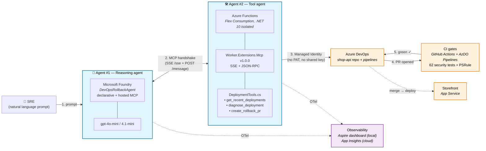
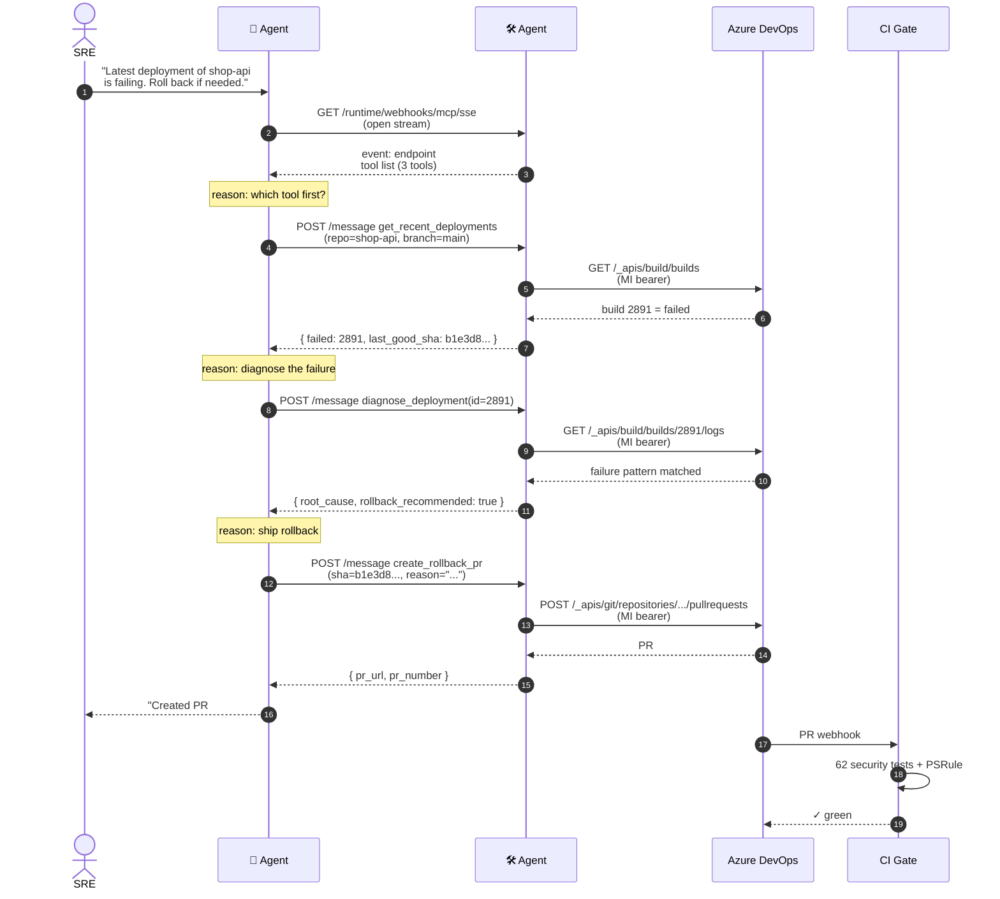
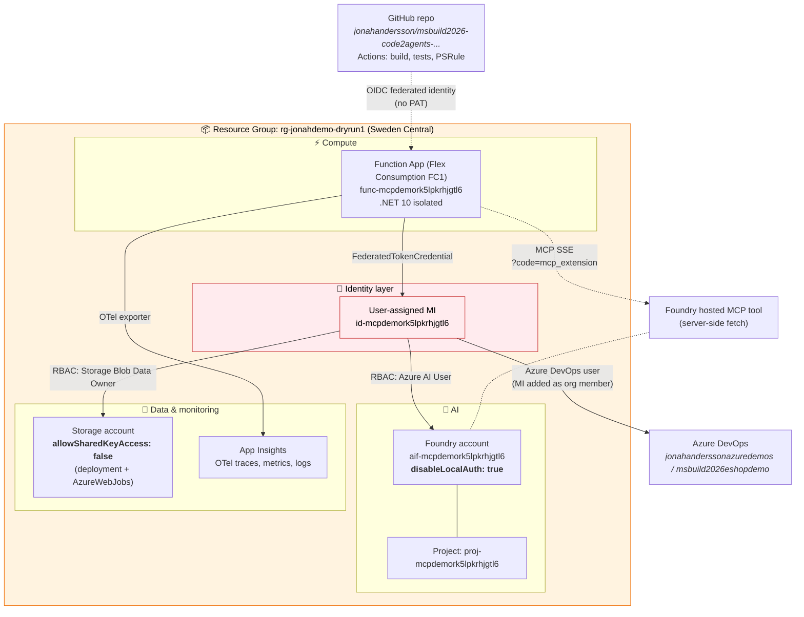
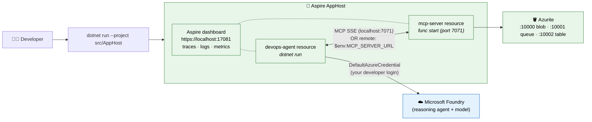
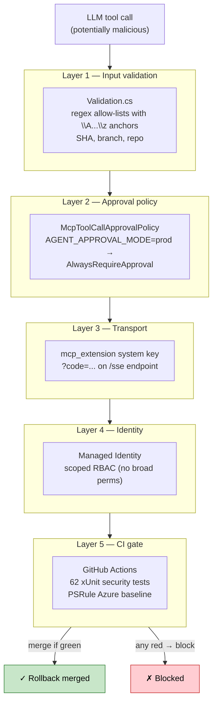

# Architecture — Code-to-Agents with MCP on Azure Functions

> **Demo:** Microsoft Build 2026 — *From Code to Agents: Build Production MCP Servers on Azure Functions*
> **Story in one line:** Two agents talk over MCP. One reasons, one acts. Together they detect a broken deployment and ship a rollback PR — observed end-to-end in a single trace.

> 🎨 **Slide-ready PNG exports** (blue & white, 4800 × 3600) live in [docs/architecture/](docs/architecture/README.md) — drop them straight into PowerPoint.

---

## 1. System overview — the agent-to-agent topology




### Reading the diagram

| Step | What happens | Where in the code |
|------|--------------|-------------------|
| 1 | User asks Agent #1 in plain English | [src/DevOpsAgent/Program.cs](src/DevOpsAgent/Program.cs) |
| 2 | Foundry opens SSE channel to MCP server, pulls tool list, reasons, calls tools | [Worker.Extensions.Mcp](https://github.com/Azure/azure-functions-mcp-extension) handles the protocol |
| 3 | Each tool uses `DefaultAzureCredential` → MI bearer token → AzDO REST | [src/DeploymentMcp/Services/AzureDevOpsClient.cs](src/DeploymentMcp/Services/AzureDevOpsClient.cs) |
| 4 | `create_rollback_pr` opens a real PR via AzDO Git API | [src/DeploymentMcp/Tools/DeploymentTools.cs](src/DeploymentMcp/Tools/DeploymentTools.cs) |
| 5 | CI workflow runs the 62-test security suite + PSRule on the PR | [.github/workflows/ci.yml](.github/workflows/ci.yml) |

---

## 2. Runtime — the live conversation (sequence)




### Why this is "agent-to-agent"

- **Agent #1** never sees a CLI command, a YAML file, or an SDK call. It receives English and decides.
- **Agent #2** never sees the user. It exposes a tool surface; it doesn't know who's calling.
- The **MCP protocol** is the only contract between them. Either side can be swapped — Claude Desktop, VS Code MCP client, or another Foundry agent could call Agent #2 unchanged.

---

## 3. Deployment topology (what `azd up` provisions)




### Identity & secrets — what's **not** in this picture

- ❌ No PATs (AzDO, GitHub, or Foundry)
- ❌ No connection strings (storage uses MI)
- ❌ No API keys hardcoded (Foundry: MI; MCP key: pulled at runtime)
- ❌ No client secrets in `local.settings.json` (only `UseDevelopmentStorage=true` for Azurite)

The **only** secret used at runtime is the Function App `mcp_extension` system key — appended as `?code=<key>` to the MCP URL when registering the hosted MCP tool with Foundry. It's pulled fresh each deploy with `az functionapp keys list`.

---

## 4. Local development loop (Aspire orchestration)




### Two run modes from the same `AppHost`

| Mode | Trigger | Used for |
|------|---------|----------|
| **LOCAL** (default) | `dotnet run --project src/AppHost` | Demo + dev — spawns `func start` |
| **REMOTE** | `$env:MCP_SERVER_URL = (azd env get-value MCP_ENDPOINT)` first | Skip local Functions host — talk to the deployed Function App. Useful when `func` Core Tools breaks. |

See [src/AppHost/Program.cs](src/AppHost/Program.cs#L31-L65) for the switch logic.

---

## 5. Security model (the layered controls)




Every layer is independently testable. See [SECURITY.md](SECURITY.md) for the threat model and [tests/DeploymentMcp.Tests/](tests/DeploymentMcp.Tests/) for the 62 enforcing tests.

---

## 6. Repository map

```
build2026-mcp-azure-functions/
├── src/
│   ├── AppHost/                   .NET Aspire orchestrator (local dev)
│   ├── ServiceDefaults/           Shared OTel + UseAzureMonitor()
│   ├── DeploymentMcp/             🛠️ Agent #2 — MCP server
│   │   ├── Tools/
│   │   │   └── DeploymentTools.cs    3 × [McpToolTrigger] methods
│   │   ├── Services/
│   │   │   ├── AzureDevOpsClient.cs  MI → AzDO REST
│   │   │   ├── Validation.cs         security allow-lists
│   │   │   └── FakeDeploymentService.cs  demo fixtures
│   │   └── Program.cs
│   └── DevOpsAgent/               🧠 Agent #1 — Foundry client
│       └── Program.cs                ResponseTool.CreateMcpTool
├── tests/
│   └── DeploymentMcp.Tests/       62 security tests
├── infra/
│   └── main.bicep                 Flex Consumption + MI + RBAC + Foundry
├── .github/workflows/
│   ├── ci.yml                     build + tests + PSRule SARIF
│   └── deploy.yml                 azd deploy (OIDC)
├── demo/shop-api-seed/            AzDO repo + pipeline seed
└── SECURITY.md                    threat model + controls
```

---

## 7. Key technical choices (and why)

| Choice | Rationale |
|--------|-----------|
| **Flex Consumption** (not Premium / App Service) | Native MI federated credentials, no Kudu dependencies, scales to zero, fits MCP's bursty pattern |
| **Hosted MCP** (server-side from Foundry) | Foundry runs the agentic loop, retries, observes — caller never wires SDKs. URL needs `?code=$key` because Foundry fetches without client auth headers |
| **`Worker.Extensions.Mcp` v1.0.0** | Official Functions extension. **SSE + JSON-RPC, not REST** — there is no `/tools/list` endpoint, only `/sse` + `/message` |
| **Declarative Foundry agent** | Instructions live on the Foundry side, versioned via `CreateAgentVersionAsync`. Agent behaviour is config, not code |
| **`disableLocalAuth: true` on Foundry** | Kills the API-key escape hatch. Only MI tokens work |
| **`allowSharedKeyAccess: false` on Storage** | Kills the connection-string escape hatch. Only MI tokens work |
| **`UseAzureMonitor()` in ServiceDefaults** | One line gives you OTel traces, logs, metrics → App Insights + Aspire dashboard. Conflicts with `AddApplicationInsightsTelemetryWorkerService` — don't use both |
| **PSRule for Azure CI gate** | Bicep is policy-checked on every PR, SARIF uploaded to Code Scanning |

---

_For the live demo flow that brings this architecture to life, see [_private/dry-run/REHEARSAL.md](_private/dry-run/REHEARSAL.md)._
