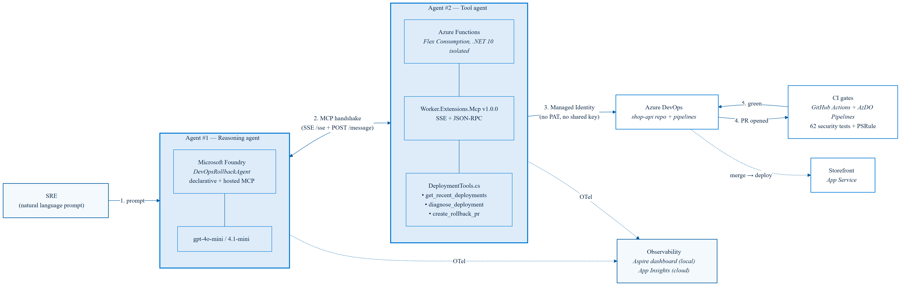
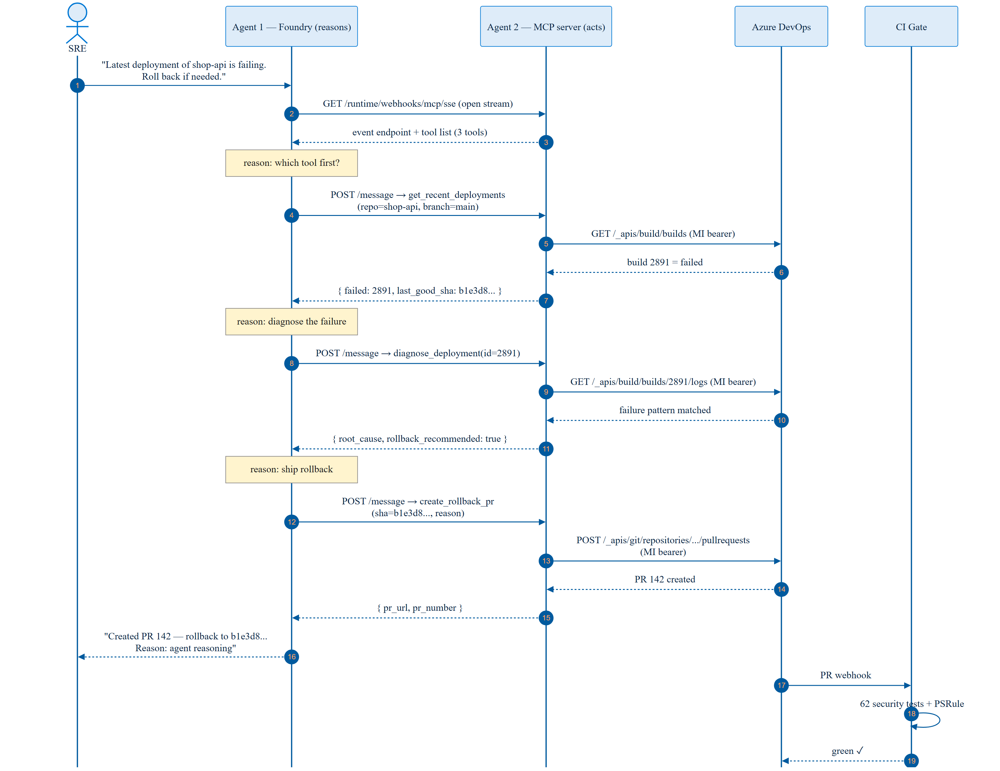
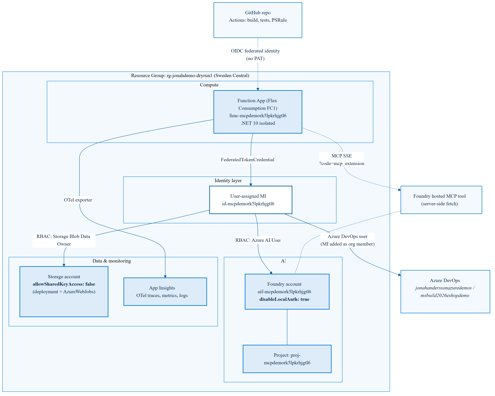
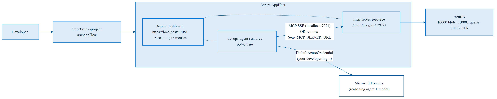
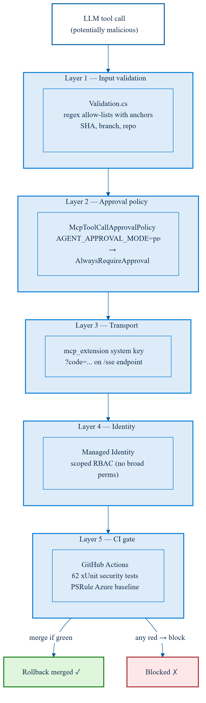

# Architecture diagrams — slide-ready assets

Blue & white theme (Microsoft Fluent palette). High-resolution PNGs for the keynote / pptx + Mermaid source so you can edit and re-render.

## Files

| # | Diagram | Source | Slide-ready PNG |
|---|---------|--------|-----------------|
| 1 | System overview (agent-to-agent topology) | [01-system-overview.mmd](01-system-overview.mmd) |  |
| 2 | Runtime sequence (live conversation) | [02-runtime-sequence.mmd](02-runtime-sequence.mmd) |  |
| 3 | Deployment topology (Azure resources + identity) | [03-deployment-topology.mmd](03-deployment-topology.mmd) |  |
| 4 | Local dev loop (Aspire + Azurite) | [04-local-dev.mmd](04-local-dev.mmd) |  |
| 5 | Security layers | [05-security-layers.mmd](05-security-layers.mmd) |  |

## Specs

- **Resolution**: 2400 × 1800 base, rendered at 2× scale (4800 × 3600 effective) — sharp on 4K displays and zoomed slides
- **Background**: white (`#FFFFFF`) — drops cleanly on any slide master
- **Palette**:
  - Primary blue `#0078D4` (Microsoft brand)
  - Light fill `#DEECF9`
  - Deep accent `#005A9E`
  - Text `#0B2545`
- **Font**: Segoe UI (matches Microsoft slide templates)

## How to use in PowerPoint

1. Insert → Pictures → This Device → pick the PNG
2. Right-click → Size and Position → uncheck "Lock aspect ratio" if you need to fit a 16:9 slide
3. For "full mode" (one diagram per slide), drag corners to fill the slide; the 4800px source keeps it crisp
4. Recommended slide order:
   - **Title slide / intro** → `01-system-overview.png`
   - **Architecture deep-dive** → `03-deployment-topology.png`
   - **Live demo flow** → `02-runtime-sequence.png`
   - **Local dev section** → `04-local-dev.png`
   - **Security / governance** → `05-security-layers.png`

## Re-rendering

If you tweak a `.mmd` source:

```pwsh
cd docs/architecture
./render.ps1
```

Requires [`@mermaid-js/mermaid-cli`](https://github.com/mermaid-js/mermaid-cli) (one-time):

```pwsh
npm install -g @mermaid-js/mermaid-cli
```

## Need other formats?

```pwsh
# SVG (vector — best for print / posters)
mmdc -i 01-system-overview.mmd -o 01-system-overview.svg -c mermaid.config.json -b white

# PDF (single-diagram handout)
mmdc -i 01-system-overview.mmd -o 01-system-overview.pdf -c mermaid.config.json -b white
```
